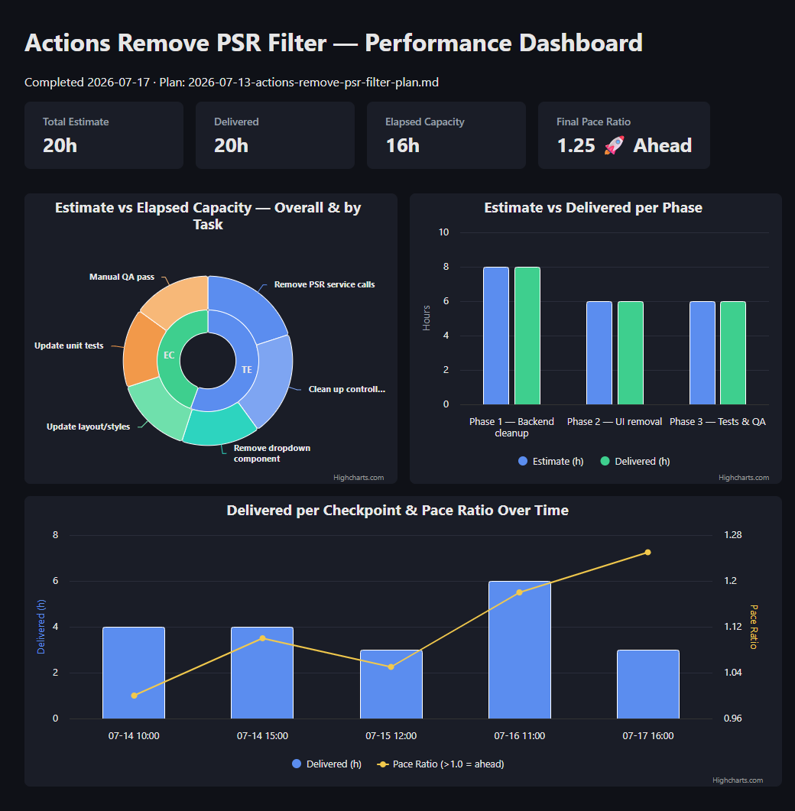

# DevSetup

This repo helps you quickly rebuild a development environment on any Windows machine -- yours after a format, or anyone else setting up a new PC. Get it via `git clone`, run the scripts, done.

**Scripts 01–03 (apps, extensions, .NET/Node/npm tools) are all optional and reflect *my* personal toolset** -- `winget-packages.json`, `vscode-extensions.txt`, `dotnet-tools.txt`, `npm-global-packages.txt`, and `node-version.txt` are just data files. If you're using this repo for yourself, edit those files to list your own apps/extensions/tools before running the scripts (or skip 01–03 entirely). The one thing that isn't personal/optional is **script 04** -- it restores the AI agent environment (Copilot skills/prompts, Claude Code config) and works the same for anyone.

## Get it

```powershell
git clone https://github.com/wilsonpinto88/DevSetup.git
cd DevSetup
```

Clone it anywhere -- `C:\dev\DevSetup`, your Desktop, wherever you like. All scripts resolve their own location automatically (`$PSScriptRoot`), so nothing is hardcoded to a specific folder, drive, or machine.

## Structure

- `winget-packages.json` – export from `winget export`; used by the optional `Scripts\01-Install-Core-Apps.ps1` (or restore manually with `winget import -i winget-packages.json`).
- `npm-global.txt` – reference list of global npm packages.
- `dotnet-tools.txt` – reference list of global .NET tools.
- `vscode-extensions.txt` – list of VS Code extensions.
- `Scripts\01-Install-Core-Apps.ps1` – optional; installs everything in `winget-packages.json` (skips anything already installed) plus NVM for Windows. Not required for the AI agent environment (script 04) -- only run this if you also want the rest of your apps restored via winget.
- `Scripts\02-Restore-VSCode-Extensions.ps1` – restores VS Code extensions from `vscode-extensions.txt`.
- `Scripts\03-Install-All.ps1` – restores VS Code extensions, .NET global tools from `dotnet-tools.txt`, NVM/Node (from `node-version.txt`) and global npm packages from `npm-global-packages.txt`. Pass `-IncludeWinget` to also run script 01 as its first step (off by default).
- `Scripts\04-Restore-Agent-Skills.ps1` -- restores the AI agent environment (Copilot skills/prompts/instructions, Copilot CLI personal instructions, Claude Code CLAUDE.MD/settings, plugins) from `AgentSetup\`.
- `AgentSetup\` -- snapshot of AI agent config (18 Copilot skills, 22 prompts, instructions, Claude Code CLAUDE.MD/settings). See `AgentSetup\README.md` for details. This is a one-way restore only (repo → machine) -- there's no export script, so update this folder manually if you change your skills/prompts later.
- `node-version.txt` – optional; one line with your Node version (e.g. `20.11.0`) for NVM install via script 03 (requires NVM for Windows already installed -- `winget install -e --id CoreyButler.NVMforWindows`, or run script 01).
- `npm-global-packages.txt` – optional; one global npm package name per line to install after Node is set up.
- `installation-progress.log` – created by script 03; append-only log of each step and item (timestamp, status).
- `installation-status.txt` – created by script 03 after each run; verification report showing which items are installed `[OK]` or missing `[--]`.

## Example: bootstrap skill dashboard output

The `bootstrap` skill (see `AgentSetup\agents-skills\bootstrap\SKILL.md`) scaffolds feature docs (`Plan/`, `Estimation_Progress/`, `Feature/`) and, once every task in `progress.md` is marked ✅ Done, can generate a self-contained `Estimation_Progress\dashboard.html` (Highcharts, no build step) summarizing the feature's performance. Sample output for a finished feature:



- **Double-ring donut** — inner ring (true donut hole): Total Estimate vs Elapsed Capacity; outer ring: per-task breakdown, colored by phase.
- **Bar chart** — Estimate vs Delivered per phase.
- **Combo chart** — Delivered-per-checkpoint bars + cumulative Pace Ratio line (>1.0 = ahead of pace), one point per task completion.

Full HTML/Highcharts template and generation rules live in the `## Dashboard Generation` section of the skill file. Live source for this example: `images\example-dashboard.html`.

## After a fresh Windows install

1. **Install Git** if you don't have it yet (`winget install --id Git.Git -e`), then clone this repo (see "Get it" above).

2. **(Optional, personal) Restore apps via winget** -- `winget-packages.json` lists *my* apps; edit it (or `Scripts\01-Install-Core-Apps.ps1`) to match your own before running, or skip this step entirely. If you do want the full app list back on a fresh machine, either run script 01 (as Administrator, so it can also set the execution policy):
   ```powershell
   .\01-Install-Core-Apps.ps1
   ```
   or import the list directly:
   ```powershell
   winget import -i winget-packages.json --accept-source-agreements --accept-package-agreements
   ```
   Both skip anything already installed, so they're safe to re-run. Not required for the steps below -- they only need Node/npm, .NET SDK, and VS Code to already be present.

3. **(Optional, personal) Run script 02 or 03** -- `vscode-extensions.txt`, `dotnet-tools.txt`, `npm-global-packages.txt`, and `node-version.txt` are also *my* personal lists; edit them first if you want your own tools instead.
   - Script 02 alone (normal PowerShell is fine): `cd` into the `Scripts` folder inside wherever you cloned the repo, then run:
     ```powershell
     .\02-Restore-VSCode-Extensions.ps1
     ```

   **Or run everything in one go (script 03)**:
   - Run script 03 to restore extensions plus .NET tools, NVM/Node, and global npm (if the optional files exist). Add `-IncludeWinget` to also run script 01 as its first step:
     ```powershell
     .\03-Install-All.ps1
     ```
   - Optional parameters: `-IncludeWinget`, `-SkipExtensions`, `-SkipDotNetTools`, `-SkipNode`, `-SkipVerify` (skip verification only).
   - After the run, check `installation-progress.log` for a timestamped log and `installation-status.txt` to see what is installed vs missing.

4. **Restore AI agent config (not personal -- works the same for anyone, normal PowerShell)**:
   - Gets you the same Copilot skills/prompts/instructions (VS Code + Copilot CLI) and Claude Code CLAUDE.MD/settings as this repo's owner:
     ```powershell
     .\04-Restore-Agent-Skills.ps1
     ```
   - See `AgentSetup\README.md` for what this restores and what platform (Copilot vs Claude Code) reads what.

5. **Optional manual steps**
   - Use `npm-global.txt` and `dotnet-tools.txt` as reference to reinstall any tools that are not available via `winget` or need manual configuration.
   - `Installed-Apps.txt` (if you have one, from a `winget list` export) is a useful personal cross-check for apps not covered by `winget-packages.json` -- not tracked in this repo since it's specific to one machine's install history.

## NVM and Node

**Before formatting (on the old machine):**

- Run in PowerShell:
  ```powershell
  nvm list
  ```
- Note your main/default Node version (for example `20.11.0`) and save it somewhere (e.g. add it at the top of `npm-global.txt` or create a small `node-version.txt` file in this folder).

**After installing NVM for Windows on the new machine** (`winget install -e --id CoreyButler.NVMforWindows`):

1. Open a new PowerShell window (so `nvm` is on PATH).
2. Install and use your preferred Node version (replace `20.11.0` with the version you noted):
   ```powershell
   nvm install 20.11.0
   nvm use 20.11.0
   node -v
   npm -v
   ```
3. Use `npm-global.txt` as a reference to reinstall any important global npm packages you used before.


